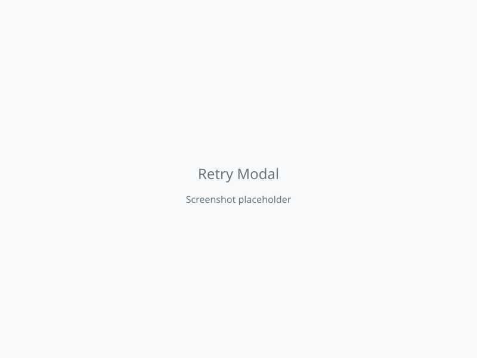
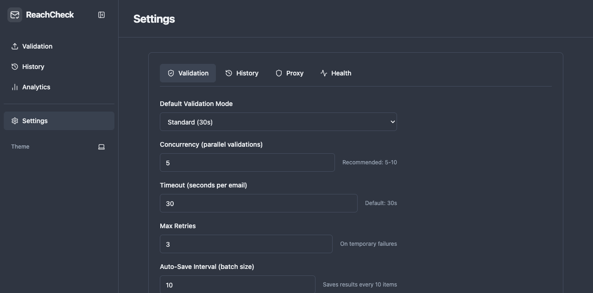
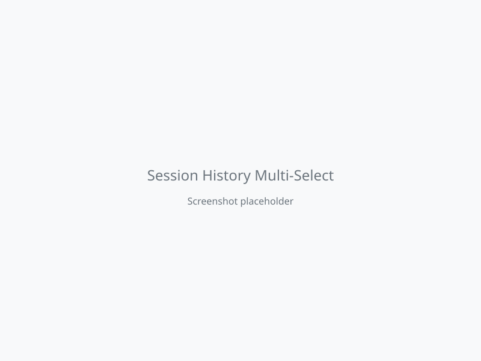
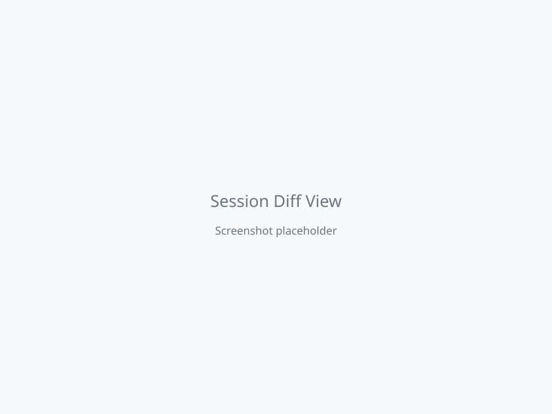
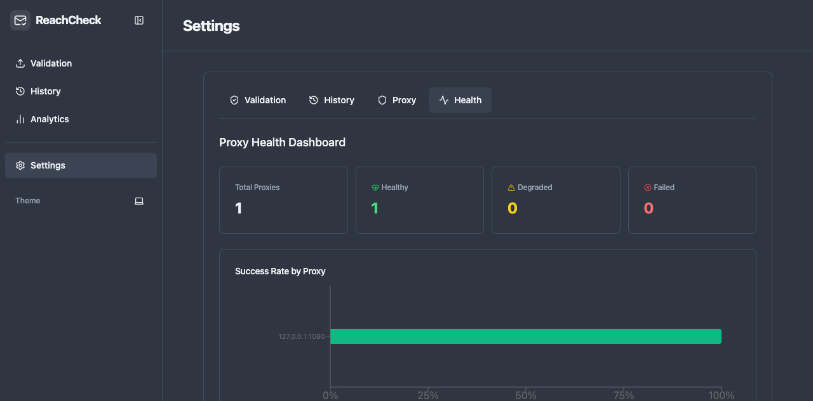
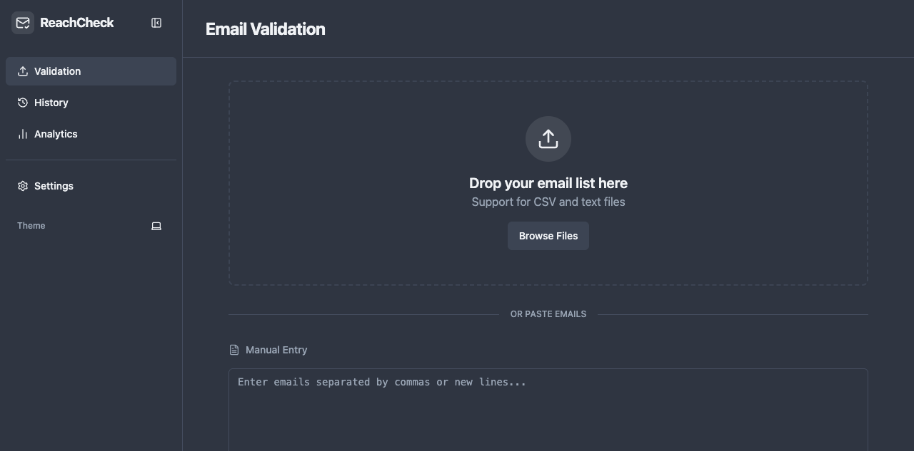

# ValidateEmails

A desktop email validation application built with Tauri (Rust) + React + TypeScript. Validates email addresses using SMTP verification via the `check-if-email-exists` library.

## Features

### Mission 1 Features (Foundation)

- **Email Validation** - Verify email deliverability via SMTP, syntax, MX records, and more
- **Bulk Validation** - Validate multiple emails concurrently with progress tracking
- **SOCKS5 Proxy Support** - Route validations through proxy servers with:
  - Single or multiple proxy configuration
  - Automatic weighted rotation (healthier proxies used more)
  - Per-domain proxy assignment (Gmail, Yahoo, Hotmail)
  - Health tracking with success/failure rates
  - Bad proxy detection (3 consecutive failures)
  - Configurable cooldown system (30-300s)
  - Failure handling modal (continue without proxy, retry, or stop)
- **Export** - CSV and Excel export with 22 configurable columns
- **Session Management** - Save, resume, and backup validation sessions
- **Risk Scoring** - Automated risk assessment based on validation results

### Mission 2 Features (Validation Resilience & Analysis)

#### Smart Retry with Escalation

Retry unknown emails with progressive validation modes through a tiered escalation system.

**Tiers:**
- **Tier 1 (Quick)**: MX record check only — fast sweep of unknowns
- **Tier 2 (Standard)**: Full SMTP handshake + forced proxy rotation
- **Tier 3 (Thorough)**: Extended timeout (30s) + 2 retries + reduced concurrency

**Usage:**
1. Complete a validation run
2. Click "Retry Unknowns" button (appears when unknown results exist)
3. Select a specific tier or enable "Auto-Escalate"
4. Click "Retry"

**Auto-Escalate Mode:**
- Automatically progresses through Tier 1 → Tier 2 → Tier 3
- Each tier only retries emails still marked as "Unknown"
- Live progress indicator shows current tier and email count
- Stops early if all unknowns are resolved



#### Rate Limiting Guard Rails

Control validation speed and prevent overwhelming email servers with comprehensive guard rails.

**Configuration (Settings → Validation):**
- **Max Per Second**: Limit SMTP connections per second (default: 1)
- **Max Per Minute**: Limit SMTP connections per minute (default: 60)
- **Max Emails Per Session**: Maximum batch size before warning (default: 0 = unlimited)

**Safety Features:**
- **Warning Dialog**: Appears when batch size exceeds `Max Emails Per Session` — shows estimated completion time based on rate limits
- **Auto-Slowdown**: After 3+ consecutive failures, automatically reduces rate and shows "Slowdown" badge
- **Auto-Pause**: After 5+ additional failures (8+ total), pauses validation and shows modal with Resume/Stop options

**Usage:**
1. Go to Settings → Validation
2. Configure rate limit values
3. Click "Save Settings"
4. Start validation — guard rails apply automatically



#### Session Comparison / Diff

Compare two validation sessions side-by-side to see what changed between runs.

**Usage:**
1. Go to History tab
2. Check the checkboxes next to exactly two sessions
3. Click "Compare Selected" button (enabled only when 2 sessions selected)
4. View detailed diff view

**Diff View Shows:**
- **Summary Cards**: Verdict counts (Safe/Risky/Invalid/Unknown) side-by-side for both sessions
- **Added Emails**: Emails present in Session B but not Session A
- **Removed Emails**: Emails present in Session A but not Session B
- **Changed Verdicts**: Emails with different verdicts between sessions (e.g., "Unknown → Safe", "Safe → Invalid")
- **Change Summary**: Badge breakdown of each transition type with counts
- **Stats Line**: "X emails changed, Y added, Z removed, W unchanged"




#### Proxy Health Dashboard

Monitor proxy health with real-time metrics, latency tracking, and configurable auto-disable rules.

**Access:** Settings → Health tab

**Features:**
- **Aggregate Summary Cards**: Total, Healthy, Degraded, Failed proxy counts
- **Success Rate Chart**: Horizontal bar chart showing success rate per proxy (color-coded: green ≥90%, yellow 50-89%, red <50%)
- **Per-Proxy Details Table**:
  - Host:Port
  - Success Rate (%)
  - Latency (average validation duration in ms)
  - Total Attempts
  - Status badge (Healthy/Degraded/Failed)
  - Auto-disabled badge (orange) when applicable
  - Re-enable button for auto-disabled proxies
- **Auto-Disable Threshold Configuration**:
  - Success Rate Below (%): Disable proxies below this rate (default: 20%)
  - Minimum Attempts: Minimum validations before checking threshold (default: 10)

**Auto-Disable Logic:**
- Proxies with `attempts ≥ minAttempts` and `successRate < threshold` are automatically disabled
- Auto-disabled proxies are excluded from rotation
- Click "Re-enable" to manually restore a proxy (resets consecutive failures)



## Getting Started

### Prerequisites

- Node.js 18+
- Rust (via rustup)
- Tauri CLI

### Install

```bash
npm install
```

### Development

```bash
npm run tauri dev
```

The app runs on port 1420.

### Build

```bash
npm run build        # TypeScript + Vite build
npm run tauri build  # Full production build
```

### Testing

```bash
npm test                                    # Run all frontend tests
npx vitest run <path>                       # Run single test file
cargo test --manifest-path src-tauri/Cargo.toml --lib  # Run Rust tests
```

## Tech Stack

- **Frontend**: React 19, TypeScript 5.8, Tailwind CSS, Shadcn UI, TanStack Query, Lucide React
- **Backend**: Tauri (Rust) with `check-if-email-exists` SMTP validation engine
- **Testing**: Vitest, @testing-library/react
- **Charts**: Recharts (for proxy health dashboard)

## Project Structure

```
src/                    # Frontend React app
  components/           # UI components
    settings/           # Proxy settings, general settings, proxy health dashboard
    validation/         # Validation dashboard, results, retry modal, rate limit dialogs
    history/            # Session history, session diff view
  hooks/                # React hooks (use-email-validation, use-settings)
  lib/                  # Utilities (export, session manager, email parser, session diff)
src-tauri/              # Rust backend
  src/
    validation.rs       # Email validation logic with proxy integration, rate limiting
    settings.rs         # Settings, proxy pool, health tracking, cooldown, auto-disable
    lib.rs              # Tauri command registration
    session.rs          # Session persistence
```

## Recommended IDE Setup

- [VS Code](https://code.visualstudio.com/) + [Tauri](https://marketplace.visualstudio.com/items?itemName=tauri-apps.tauri-vscode) + [rust-analyzer](https://marketplace.visualstudio.com/items?itemName=rust-lang.rust-analyzer)

## Mission 2 Validation Assertions

All Mission 2 features are validated against a comprehensive contract:

| Area | Assertions | Tool |
|------|------------|------|
| Smart Retry | VAL-RETRY-001 to VAL-RETRY-008 | agent-browser, vitest |
| Rate Limiting | VAL-RATE-001 to VAL-RATE-010 | agent-browser, cargo test |
| Session Diff | VAL-DIFF-001 to VAL-DIFF-017 | agent-browser, vitest |
| Proxy Health | VAL-PROXY-001 to VAL-PROXY-014 | agent-browser, cargo test |

## Mission 3: Playwright + Tauri Integration Testing

Mission 3 sets up Playwright with Tauri driver for full integration testing of the Tauri desktop app.

### Test Infrastructure

- **Playwright 1.60+** with `@srsholmes/tauri-playwright` and `@crabnebula/tauri-driver`
- **Tauri plugin**: `tauri-plugin-playwright` v0.2 with `e2e-testing` feature flag
- **Dual-mode Playwright config**: browser-only (CI) + Tauri WebView (integration)
- **Test helpers**: Tauri app launch/teardown, event simulation, page objects

### Validation Assertions (15 total)

| Area | Assertions | Tool |
|------|------------|------|
| Playwright Setup | VAL-PW-001 to VAL-PW-004 | npm, playwright |
| Retry Modal | VAL-PW-005 to VAL-PW-008 | playwright (browser-only) |
| AutoPauseModal | VAL-PW-009 to VAL-PW-012 | playwright (browser-only) |
| Cross-Area Flows | VAL-PW-013, VAL-PW-014 | playwright (browser-only) |
| Tauri Events | VAL-CROSS-PW-001 | playwright (browser-only) |

**Note**: UI component tests (retry modal, auto-pause modal, cross-area flows) run in browser-only mode due to fundamental Tauri WebView (WebKit) rendering limitations with Radix UI Dialog portal components. Tauri WebView integration is validated for IPC event handling (VAL-CROSS-PW-001).

### Running Tests

```bash
# Frontend unit tests
npm test

# Backend Rust tests
cargo test --manifest-path src-tauri/Cargo.toml --lib

# Type checking
npm run build

# Linting
npm run lint

# Playwright E2E tests (browser-only mode)
npx playwright test --project=browser-only

# Playwright E2E tests (Tauri mode - requires Tauri dev server)
cargo tauri dev --features e2e-testing &
npx playwright test --project=tauri
```

### Test Structure

```
tests/
  e2e/
    retry-modal.spec.ts          # Retry modal tests (VAL-PW-005 to VAL-PW-008)
    auto-pause-modal.spec.ts     # AutoPauseModal tests (VAL-PW-009 to VAL-PW-012)
    cross-area-flows.spec.ts     # Cross-area flow tests (VAL-PW-013, VAL-PW-014)
    tauri-events.spec.ts         # Tauri IPC event tests (VAL-CROSS-PW-001)
  helpers/
    tauri-app.ts                 # Tauri app launch/teardown
    events.ts                    # Event simulation helpers
  pages/
    retry-modal.ts               # Retry modal page object
    auto-pause-modal.ts          # AutoPauseModal page object
    settings.ts                  # Settings page object
    session-history.ts           # Session history/diff page object
```

## Run validation
```bash
# Frontend tests
npm test

# Backend tests
cargo test --manifest-path src-tauri/Cargo.toml --lib

# Type checking
npm run build

# Linting
npm run lint

# Playwright E2E (browser-only)
npx playwright test --project=browser-only
```

## Screenshots

### Main Application


### Settings — Validation Tab (Rate Limiting)


### Settings — Health Tab (Proxy Health Dashboard)


### Smart Retry Modal


### Session History with Multi-Select


### Session Diff Comparison View


## License

MIT
